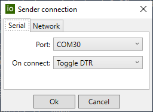
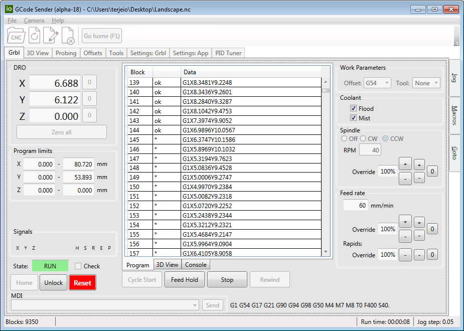
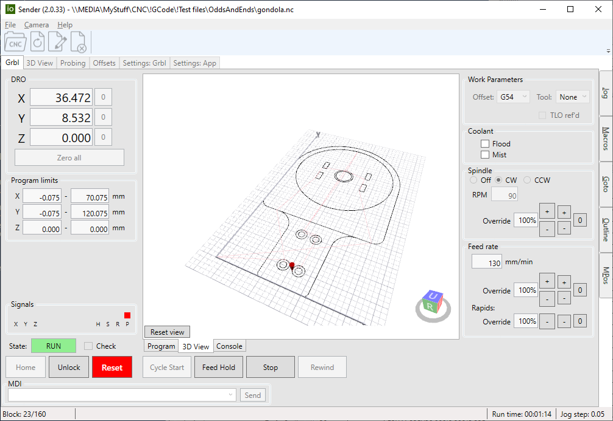
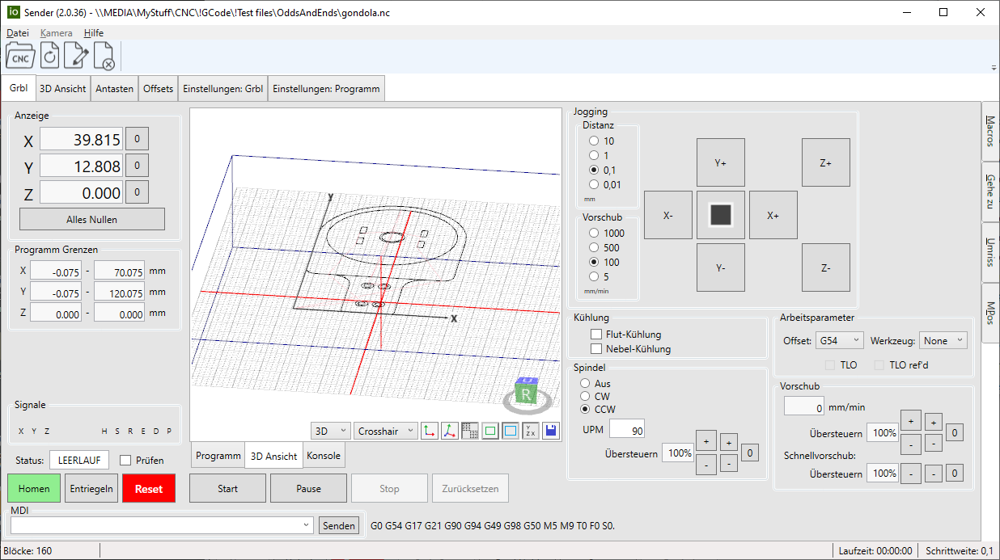
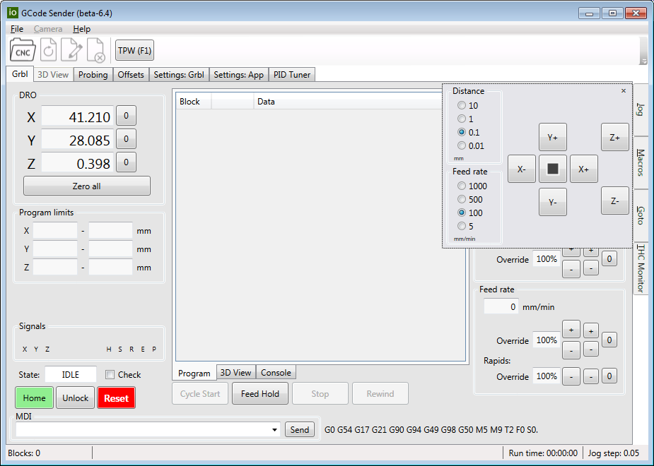
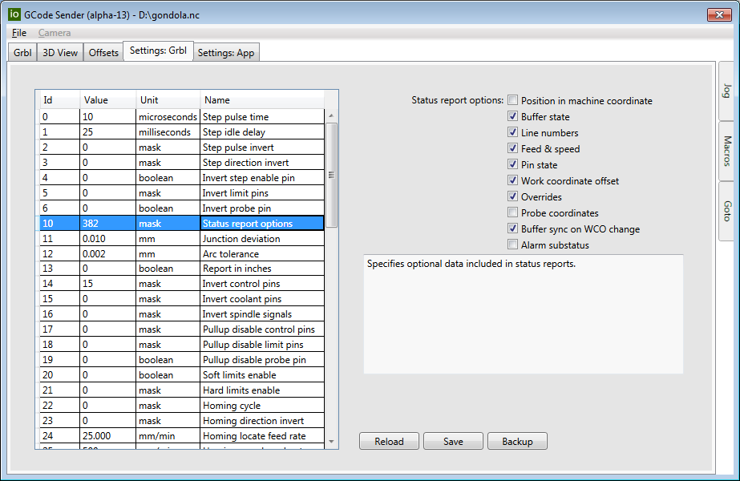
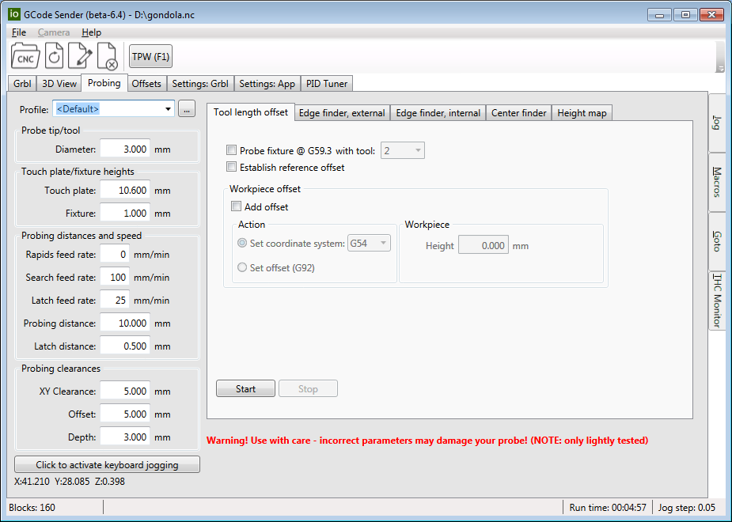
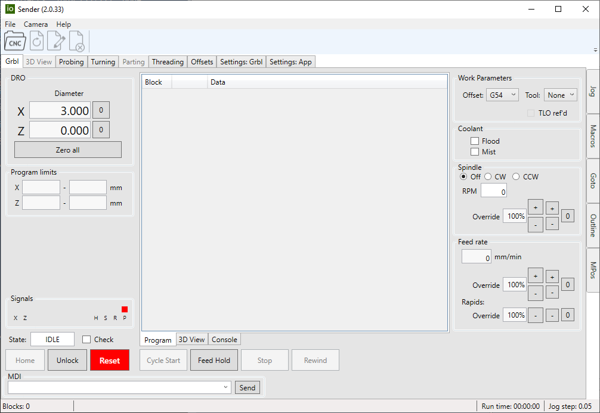
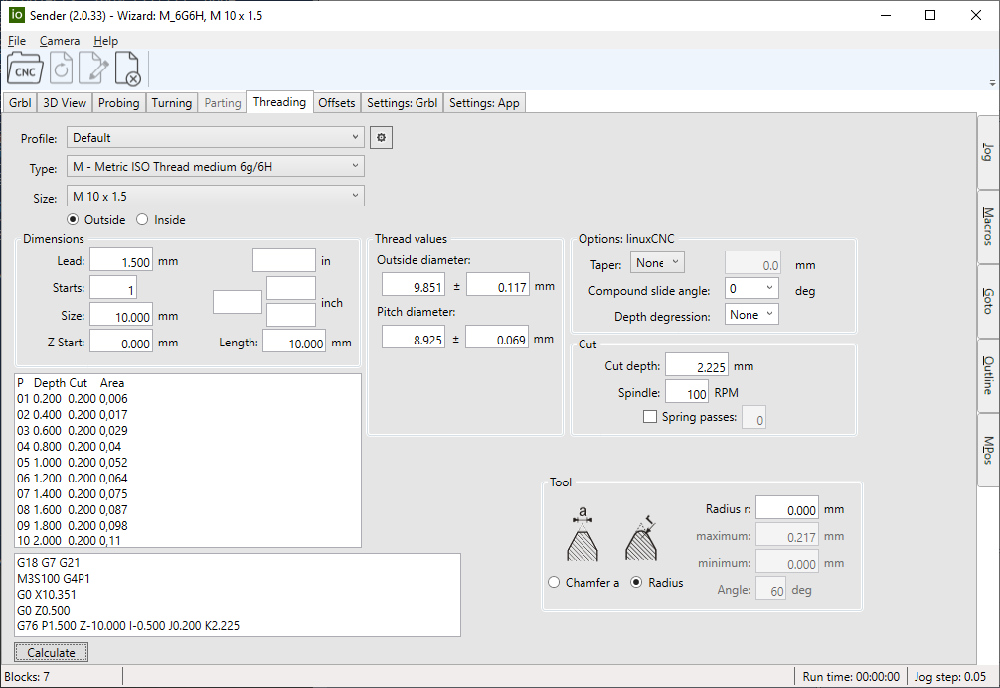

## ioSender - a gcode sender for grblHAL and Grbl controllers

---

Please check out the [Wiki](https://github.com/terjeio/Grbl-GCode-Sender/wiki) for further details.

8-bit Arduino controllers needs _Toggle DTR_ selected in order to reset the controller on connect. Behaviour may be erratic if not set.

If you want to test ioSender with grblHAL but do not have a board yet you can use the [grblHAL simulator](https://github.com/grblHAL/Simulator).
Build it with the [Web Builder](http://svn.io-engineering.com:8080/?driver=Simulator&board=Windows), unpack the .exe-files in the downloaded .zip somewhere and
open a command window (cmd or PowerShell) in the folder by \<Shift\>+Right clicking in it, select the _Open PowerShell window here_ or
_Open command window here_ from the popup menu to open it.
Then find your computers IP address by typing `ipconfig` - the IP address can be found in the report generated.  
Run the simulator by typing `./grblHAL_sim -p 23` - 23 is the default Telnet port number and you may have to change it if a Telnet server is already running on the machine.
Leave the window open.  
Now start ioSender and select the _Network_ tab in the sender connection dialog, change the port number if you run the simulator with a different port,
type in your computers IP address and click _Ok_ to connect.  
You can run gcode programs, jog, access settings etc. but _not_ use gcodes that needs input - e.g. probing.  
The simulator can be stopped by typing \<Ctrl\>+C in the command window or by closing it.

---

Latest release is 2.0.44, see the [changelog](changelog.md) for details. 

---

Some UI examples:

Main screen.
  

3D view of program, with live update of tool marker.
  

XL version, German translation.
  

Jogging flyout, supports up to 9 axes. The sender also supports keyboard jogging with \<Shift\> \(speed\) and \<Ctrl\> \(distance\) modifiers.
  

Advanced grbl configuration with on-screen documentation. UI is dynamically generated from data in a file and/or from the controller.
  

Probing options.
  

Lathe mode.
  

Conversational programming for Lathe Mode. Threading requires [grblHAL](https://github.com/grblHAL) controller with driver that has spindle sync support.

---
2024-02-20
